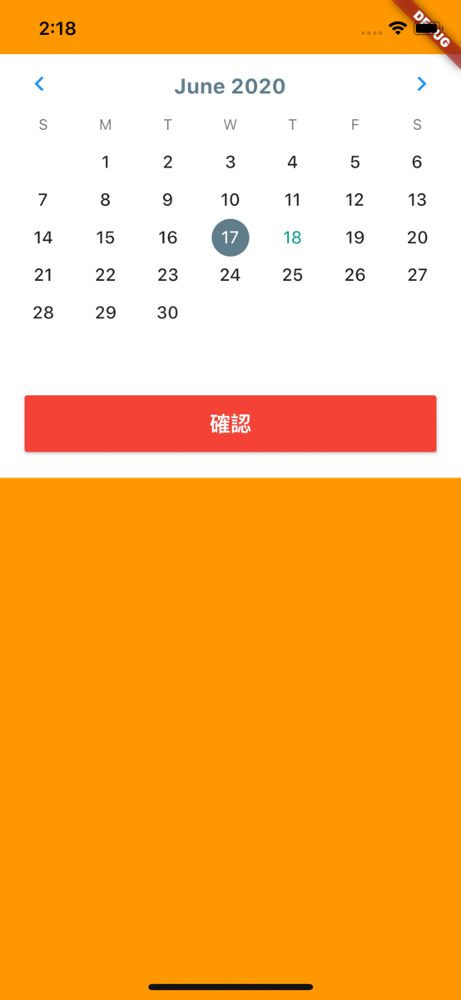

## Demo

## Getting Started

### Installation

Add to `pubspec.yaml` in `dependencies` 

...
  calendar_range:
    git:
      url: https://github.com/Neil2847/calendar_range.git
...

### Usage
...
import 'package:calendar_range/calendar_range.dart';
...
    return Container(
      color: Colors.orange,
      child: SafeArea(
        child: CalendarRange(
          initialFirstDate: DateTime.parse('2020-06-18'),
          initialLastDate: null,
          firstDate: new DateTime(2018),
          lastDate: new DateTime(2021),
          selectedColor: Colors.blueGrey,
          btnColor: Colors.red,
          arrowColor: Colors.blue,
          btnTitle: '確認',
          onClick: (days) {
            days.forEach((date) {
              print('selected date :$date');
            });
          },
        ),
      ),
    );
...
